## 1.中断

每个核心（Core0 和 Core1）都有独立的 NVIC（相当于专属的 “中断调度员”），它能接收 32 个中断信号，但 RP2040 只用到了前 26 个（IRQ0\~25），剩下的 IRQ26\~31 是预留的（也能强制触发）。当外设（如定时器、UART）触发紧急任务时，会向对应的 IRQ 发送信号，NVIC 再调度核心处理。

在 RP2040 上，只有较低的 26 个 IRQ 信号被连接在 NVIC 上，而 IRQs 26 到 31 没有绑定。通过在 NVIC ISPR 寄存器中写入位 26 到 31，核心仍然可以被强制输入相关的中断处理程序。

RP2040 的中断向量表如下，这个表是 “IRQ 的任务清单”，每个 IRQ 编号对应一个具体的 “紧急任务来源”：

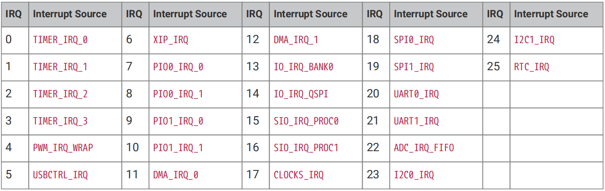

比如 IRQ0 对应 “定时器 0 的 IRQ”（定时器 0 到点了）、IRQ20 对应 “UART0 的 IRQ”（UART0 收到数据了）。核心看到 IRQ 编号，就能立刻知道是哪个外设发的 “紧急呼叫”，进而调用对应的处理程序。

各个中断含义如下：
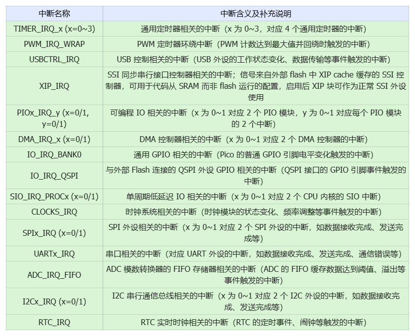

实际上，中断还可以分为下面两种：​**可屏蔽中断（IRQ，Interrupt Request​）和不可屏蔽中断（NMI，Non Maskable ​Interrupt）** ​，两者的核心差异在于 “是否能被 CPU 选择性忽略”，表格总结如下：
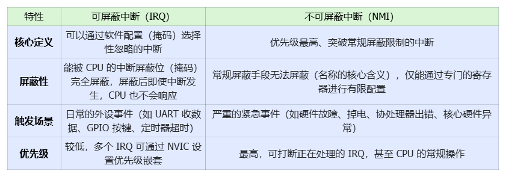

简单来说：

* 可屏蔽中断（IRQ）是 “日常级” 中断，比如手机收到微信消息提醒（你可以开免打扰屏蔽它）；
* 不可屏蔽中断（NMI）是 “紧急级” 中断，比如手机检测到电池即将耗尽的报警（即使开了免打扰，这个报警也会强制弹出）。

树莓派 Pico 的 26 个系统中断（如 TIMER\_IRQ、UART\_IRQ、GPIO\_IRQ 等），会经过两步处理后，与内核中断合并为一个 NMI 信号输入到对应 CPU 内核，整个流程可以理解为 “中断的筛选与合并”：

1. **​第一步，掩码屏蔽（选择性忽略部分系统中断）：​**首先，26 个系统中断会经过掩码屏蔽处理—— 相当于给这些中断设置 “免打扰开关”，你可以通过配置掩码寄存器，选择 “哪些系统中断即使发生，也暂时忽略”。比如你可以设置 “屏蔽 UART\_IRQ”，那么即使 UART 收到数据，这个中断也不会进入后续处理流程。
2. **​第二步，与内核中断做 OR 运算，合并为 NMI：​**经过掩码屏蔽后，剩下的 “未被忽略的系统中断”，会和 CPU 内部的内核中断（比如掉电、协处理器运算出错、硬件故障等更严重的内部异常）进行 OR 运算（只要其中任意一个中断发生，结果就为 “有中断”）。最终，这些分散的中断信号会被合并为一个统一的 NMI 信号，输入到 CPU 内核中。

这个流程的核心目的是：​**将所有需要最高优先级处理的紧急事件，统一封装为 NMI 信号，确保 CPU 能优先响应这些关键事件**​。
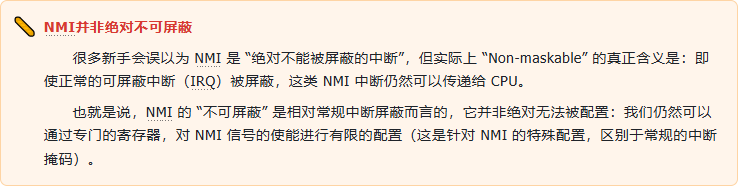

**NMI 并非绝对不可屏蔽**

很多新手会误以为 NMI 是 “绝对不能被屏蔽的中断”，但实际上 “Non-maskable” 的真正含义是：即使正常的可屏蔽中断（IRQ）被屏蔽，这类 NMI 中断仍然可以传递给 CPU。

也就是说，NMI 的 “不可屏蔽” 是相对常规中断屏蔽而言的，它并非绝对无法被配置：我们仍然可以通过专门的寄存器，对 NMI 信号的使能进行有限的配置（这是针对 NMI 的特殊配置，区别于常规的中断掩码）。

树莓派 Pico 为两个 CPU 内核（`Core0`、`Core1`）分别提供了专门的配置寄存器，这些寄存器属于 `Syscfg` 寄存器块（基地址为 `0x40000000`），用于控制 NMI 信号的使能：

* PROC0\_NMI\_MASK 寄存器：对应 Core0 内核，用于配置 Core0 的 NMI 信号使能；
* PROC1\_NMI\_MASK 寄存器：对应 Core1 内核，用于配置 Core1 的 NMI 信号使能。

这两个寄存器的核心作用是：精细化控制哪些合并后的 NMI 信号能真正传递到对应内核。比如你可以通过 PROC0\_NMI\_MASK 寄存器，设置 “仅让硬件故障相关的 NMI 信号传递到 Core0，其他 NMI 信号暂时屏蔽”，这是对 NMI 的特殊配置，也是唯一能对 NMI 进行 “筛选” 的方式。

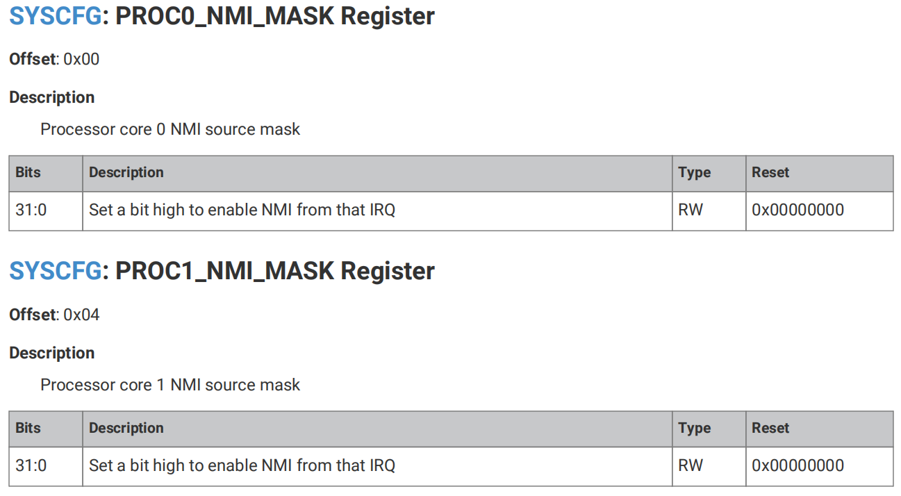

两个寄存器的 `31:0` 位（共 32 个 bit），与树莓派 Pico 的 32 个系统 IRQ（中断）一一对应：

* 第 `n` 位（比如 bit0、bit5）对应 “IRQ `n`”（比如 bit0 对应 IRQ0，bit5 对应 IRQ5）。
* 每个 bit 的功能：将某一位设为 1（置高），表示 “启用该位对应的 IRQ 作为当前内核的 NMI 中断源”；设为 0 则表示 “禁用该 IRQ 作为 NMI 源”。

其操作特性包括：

* ​**读写权限（Type: RW）** ​：可以通过代码读取寄存器当前值，也可以修改其位值。
* ​**复位值（Reset: 0x00000000）**​：芯片上电后，所有位默认是 0，意味着​**默认没有任何 IRQ 被设为 NMI 源**​，必须手动配置才会生效。

## **2.NVIC 控制器**

NVIC 中断向量控制器相关的寄存器的基地址为 `PPB_BASE=0xe0000000`，它是树莓派 Pico 中控制 “内核直接交互的内部外设” 的寄存器集合，这些内部外设（如 SysTick 定时器、NVIC 中断控制器）是与 CPU 内核紧耦合的核心组件，负责内核的定时、中断调度、内存保护等基础功能。

需要特别注意：所有 PPB\_BASE 下的寄存器，只能以 “字（32 位）” 的方式读写（不能拆分成字节 / 半字操作），且采用 “小端序” 存储（即数据的低位字节存放在内存的低位地址）。

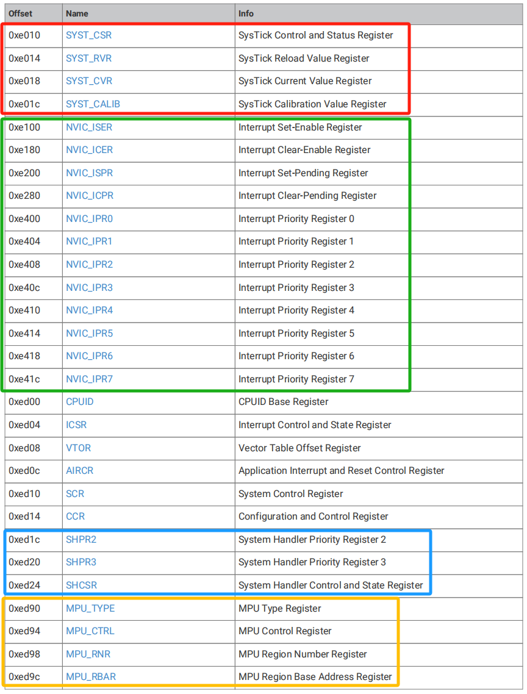

其中：

* 红色框内是 `SysTick`（系统滴答定时器） 的专用寄存器，`SysTick` 是 CPU 内核自带的基础定时器，常用于生成定时中断、实现延时等功能；
* 绿色框内是 `NVIC`（嵌套中断控制器） 的关键寄存器，对应之前讲的 “中断调度员” 功能，负责中断的使能、挂起、优先级配置；
* 蓝色框内是系统处理程序的寄存器，负责管理 “系统级中断”（如 `NMI`、硬故障）的优先级与状态；
* 黄色框内是 `MPU`（内存保护单元） 的寄存器，`MPU` 是用于 “保护内存区域” 的组件（比如防止程序非法访问某段内存）。

树莓派 Pico 中断 NVIC 在硬件中支持嵌套中断：一个低优先级的中断可以被一个高优先级的中断（或另一个异常，如硬故障）抢占，一旦高优先级的异常完成，低优先级的中断将恢复。

当多个 IRQ 同时触发时，核心会按 “紧急程度” 依次处理，RP2040 的 NVIC 优先级级别为 2 个 bit 就是 4 种 NVIC 中断配置，优先级分两层判断：

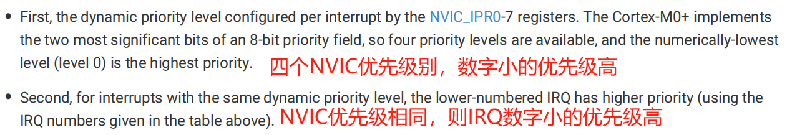

* ​**NVIC 动态优先级**​：通过寄存器可以给每个 IRQ 设 4 个优先级（0\~3），​**数字越小紧急程度越高**​（比如 0 级是最高优先级，会优先于 1 级处理）；
* ​**IRQ 编号优先级**​：如果两个 IRQ 的 NVIC 优先级相同，就看 IRQ 编号 ——​**编号越小紧急程度越高**​（比如 IRQ0 的优先级高于 IRQ1）。

可以使用 NVIC\_IPRxRegister(x=0\~7)寄存器来对每个中断设置 0 到 3 的优先级，其中 0 是最高的优先级、3 是最低的优先级。

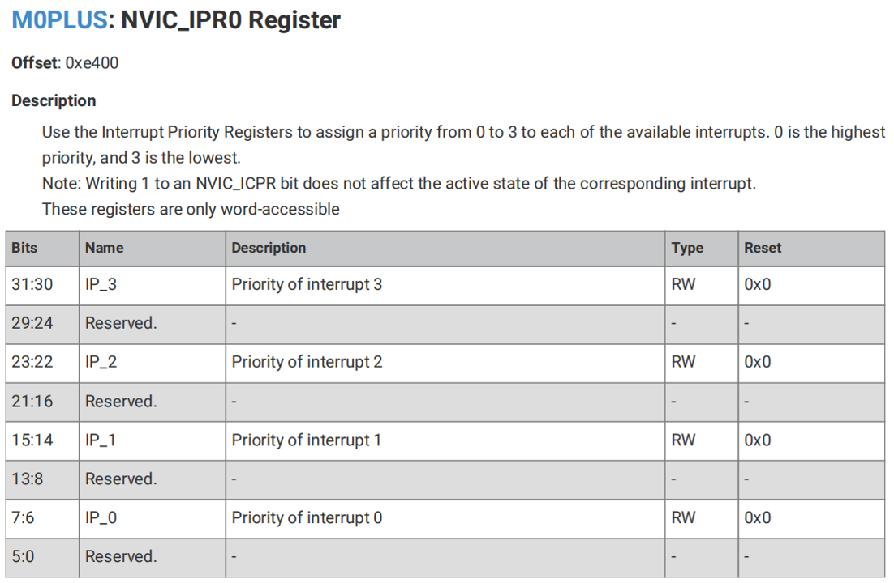

我们可以通过 NVIC\_ISER 寄存器来使能中断或查看中断是否使能，如果使能了正在被挂起的中断（指低优先级中断被高优先级中断抢占执行），那么 NVIC 控制器会根据其优先级激活该中断。如果某个中断并未使能，断言其中断信号会将该中断改为挂起状态，但 NVIC 将不会激活该中断，无论其优先级。

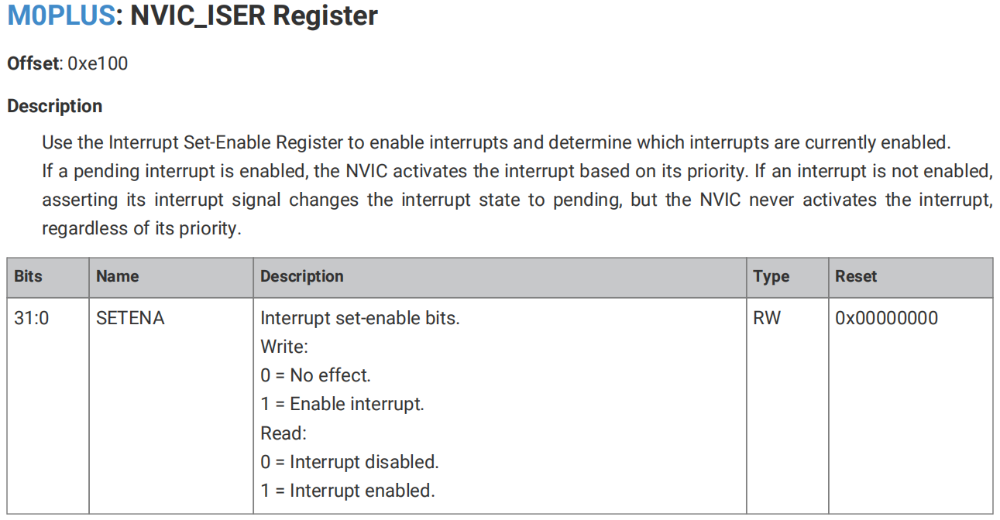

类似地，我们可以通过 `NVIC_ICER` 寄存器禁用中断或查看中断是否失能。

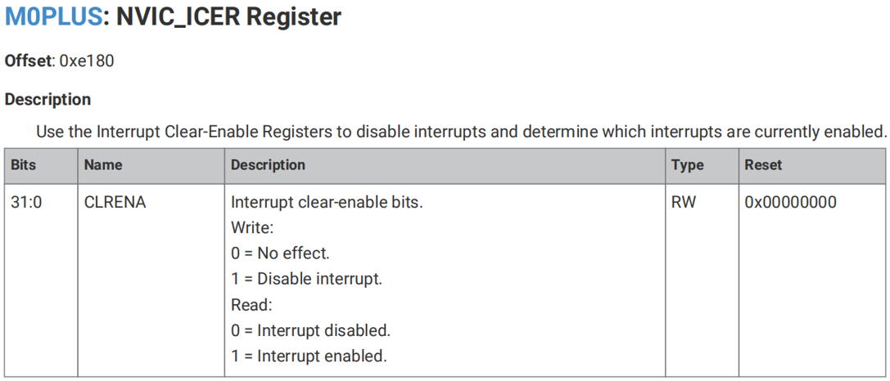

我们可以使用 `NVIC_ISPR` 寄存器强制中断进入挂起状态或查看中断是否被挂起。

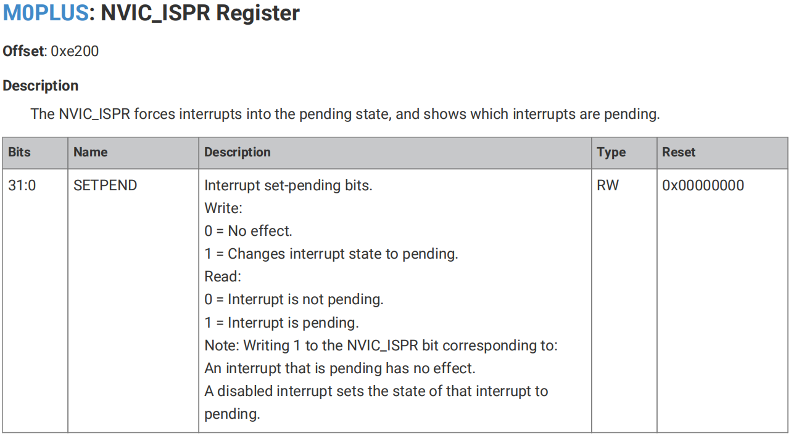

类似地，我们可以通过 `NVIC_ICPR` 寄存器清除中断的挂起状态或查看中断是否被挂起。

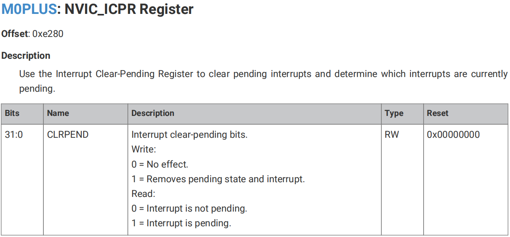
